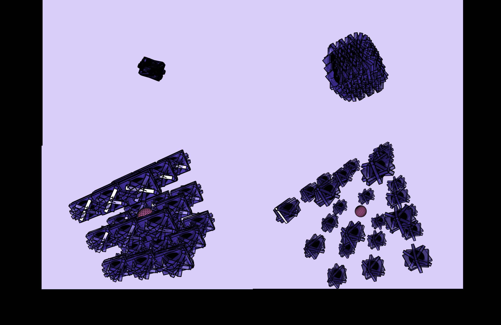

# 🌌 3D Burst Animation – p5.js (WEBGL)

This is a generative 3D sketch built using p5.js in WEBGL mode.  
It features an animated burst of 3D shapes expanding in all directions with lighting, rotation, and a glowing central orb.

> ✅ Live Demo: [Click here to view it](https://edwin1618t.github.io/p5js-sketches/)

---

## ✨ Features

- 📦 3D cubes + spheres animated in 26 directions
- 🎥 Global rotation with pause control (`spacebar`)
- 🎇 Glowing central orb using `emissiveMaterial()`
- 🖱 Orbit camera control with `orbitControl()`
- 💡 Dynamic lighting (`ambientLight`, `directionalLight`)
- ⏱ Smooth time-based motion via `t` instead of `frameCount`

---

## 🛠 Technologies Used

- JavaScript (ES6)
- [p5.js](https://p5js.org/)
- WEBGL 3D rendering mode
- GitHub Pages (for live deployment)

---

## 📸 Preview



---

## 📂 File Structure

```bash
p5js-sketches/
├── index.html       # Main entry point
├── sketch2.js       # 3D animation logic
├── image.png        # Preview image (optional)
├── README.md        # This file
